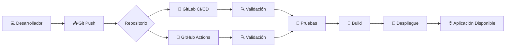
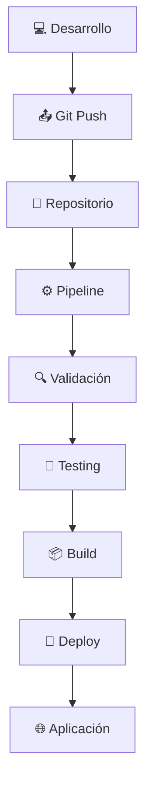

# ⚙️ GitLab CI/CD & GitHub Actions

<p align="center">


</p>

---

# 🚀 Automatización de Integración y Entrega Continua

Bienvenido al repositorio de laboratorios de **CI/CD**, en el cual aprenderás a automatizar el proceso de construcción, validación y despliegue de aplicaciones utilizando dos de las plataformas más utilizadas actualmente en la industria:

- 🦊 **GitLab CI/CD**
- 🐙 **GitHub Actions**

Durante los laboratorios se implementarán pipelines reales que permitirán comprender el funcionamiento de la automatización dentro de un flujo DevOps moderno.

---

# 🎯 Objetivos

Al finalizar los laboratorios podrás:

- ⚙️ Comprender el funcionamiento de un pipeline CI/CD.
- 📦 Automatizar procesos de validación, pruebas y despliegue.
- 🐳 Integrar Docker dentro de un pipeline.
- 🔍 Ejecutar pruebas automáticas antes del despliegue.
- 🚀 Publicar aplicaciones de manera automatizada.

---

# 📚 Contenido del repositorio

```text
📦 CI-CD-Labs
│
├── 📁 GitLab
│   ├── Instalacion.md
│   └── ...
│
├── 📁 GitHub-Actions
│   └── ...
│
└── 📄 README.md
```

---

# 🔄 Flujo general de un Pipeline



---

# 🦊 GitLab CI/CD

GitLab CI/CD es una plataforma integrada dentro de GitLab que permite automatizar el ciclo de vida del software mediante **pipelines** definidos en el archivo:

```text
.gitlab-ci.yml
```

Con GitLab CI/CD se realizarán actividades como:

- 📦 Validación del código.
- 🧪 Ejecución de pruebas automáticas.
- 🐳 Construcción de imágenes Docker.
- 🚀 Despliegue automático de aplicaciones.
- 📊 Visualización del estado de los pipelines.

---

# 🐙 GitHub Actions

GitHub Actions es la solución de automatización integrada en GitHub que permite ejecutar flujos de trabajo (**Workflows**) definidos mediante archivos YAML ubicados en:

```text
.github/workflows/
```

Durante los laboratorios se utilizará para:

- 🔍 Validar proyectos automáticamente.
- 🧪 Ejecutar pruebas unitarias.
- 📦 Compilar aplicaciones.
- 🐳 Construir imágenes Docker.
- 🚀 Automatizar despliegues.

---

# ⚖️ Comparación rápida

| Característica | 🦊 GitLab CI/CD | 🐙 GitHub Actions |
|----------------|-----------------|-------------------|
| Integración con Git | ✅ Nativa | ✅ Nativa |
| Archivo de configuración | `.gitlab-ci.yml` | `.github/workflows/*.yml` |
| Runner propio | ✅ Sí | ✅ Sí |
| Marketplace de acciones | ⚪ Limitado | ✅ Muy amplio |
| Docker | ✅ Excelente | ✅ Excelente |
| Kubernetes | ✅ Integrado | ✅ Compatible |
| Uso en proyectos empresariales | ⭐⭐⭐⭐⭐ | ⭐⭐⭐⭐⭐ |

---

# 🧩 Flujo DevOps utilizado en los laboratorios



---

# 🛠️ Tecnologías utilizadas

- 🐳 Docker
- 🦊 GitLab CE
- 🏃 GitLab Runner
- 🐙 GitHub Actions
- 🐍 Python
- 🌐 Flask
- 🧪 Pytest
- 🔀 Git
- ☁️ CI/CD

---

# 💡 Competencias desarrolladas

A través de estos laboratorios el estudiante desarrollará competencias relacionadas con:

- 🔄 Automatización de procesos de integración continua.
- 📦 Construcción de aplicaciones mediante pipelines.
- 🧪 Ejecución de pruebas automatizadas.
- 🚀 Automatización de despliegues.
- ⚙️ Configuración de entornos CI/CD.
- 🐳 Integración con Docker.
- 📊 Interpretación de resultados de ejecución.

---

# 🎓 Enfoque del repositorio

Los laboratorios están diseñados para un **curso de formación profesional en DevOps**, por lo que cada práctica incluye:

- 📖 Explicaciones paso a paso.
- 💻 Ejemplos completamente funcionales.
- 🧪 Casos prácticos.
- ⚙️ Configuraciones reales.
- 🚀 Automatización basada en buenas prácticas de la industria.

---

<p align="center">

## ⭐ ¡Bienvenido al mundo de la Automatización con GitLab CI/CD y GitHub Actions!

**Aprende • Automatiza • Despliega • Innova**

</p>
